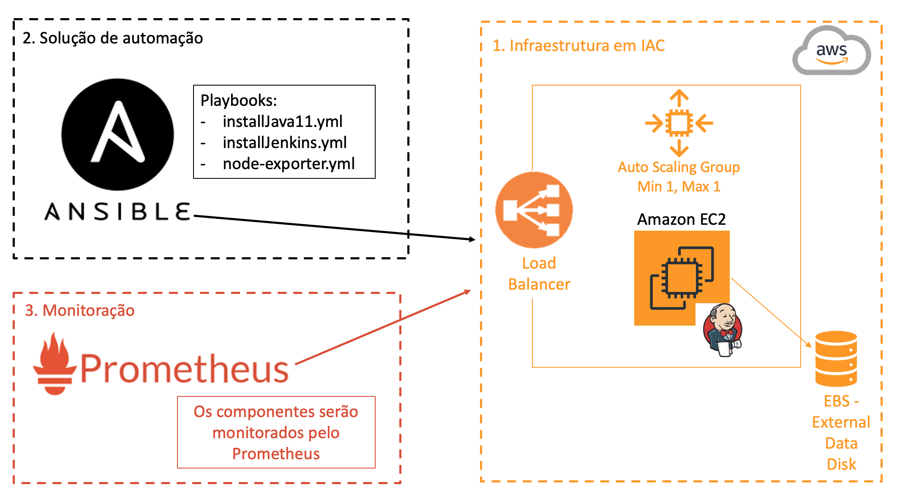

# Introdução
A imagem abaixo mostra a arquitetura:

Será dividido em 3 partes:
1. Infraestrutura em IAC
2. Solução de automação
3. Monitoração

# Infraestrutura em IAC
O cloud provider escolhido foi a AWS e o IAC foi escrito em Terraform. Os arquivos estão dentro da pasta "terraform". 
Com isso será provisionado um load balancer com autoscaling group para HA (high availability) e terá apenas uma máquina no ASG. Não será necessário a persistencia de dados pois haverá apenas uma máquina (um Jenkins Master) e terá um disco externo que armazenará os dados do Jenkins. Se uma máquina dar um "crash", o ASG será encarregado de criar uma nova máquina e o disco externo será anexado na nova máquina.
Além do LB e o ASG, será provisionado o security group com as regras necessárias para o Jenkins funcionar, o playbook ser remotamente executado e o agente do Prometheus enviar os dados para o servidor e assim ser monitorado.

# Solução de automação
A solução de automação escolhida foi o Ansible. Os playbooks estão dentro da pasta "ansible_playbooks". Há 3 playbooks:
  - installJava11.yml -> Instala o Java 11 que é pré-requisito para instalação do Jenkins.
  - installJenkins.yml -> Instala o Jenkins.
  - node-exporter.yml -> Instala o agente do Prometheus para coletar as métricas e enviar ao servidor do Prometheus.
    
# Monitoração
A ferramenta escolhida para fazer a monitoração é o Prometheus que é um modelo distribuído e facilita o desacoplamento de componentes.
O Ansible possui um playbook chamado "node-exporter.yml" para instalar o agente. Esse agente coletará as métricas e assim enviará as métricas para o servidor do Prometheus.

